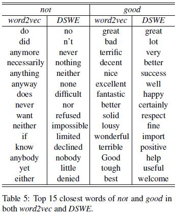
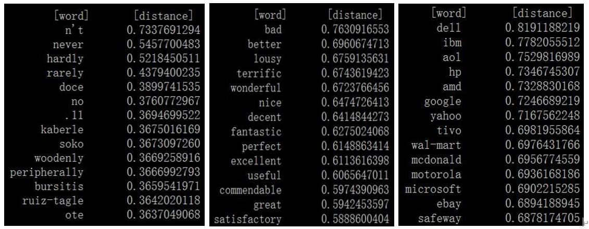
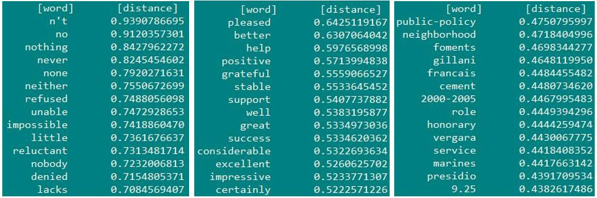

# Projects-For-NLP-Bigenner

Typical projects for NLP beginners.

## Environment
Python 3.8 \
PyTorch 1.0 or above

## Tutorial

- PyTorch Tutorail: https://pytorch.org/tutorials/
- PyTorch Tutorial: https://github.com/yunjey/pytorch-tutorial/tree/master/tutorials
- NLP Tutorial: https://github.com/graykode/nlp-tutorial

## P1 Word Embeddings
### Learning Word Embeddings    
   
   - Paper1: Distributed Representations ofWords and Phrases and their Compositionality (NIPS 2013) 
   - Paper2: Learning Sentiment-Specific Word Embedding for Twitter Sentiment Classification (ACL 2014)
   - Paper3: Improving Implicit Discourse Relation Recognition with Discourse-specificWord Embeddings (ACL 2017)
   1. SimpCBOW: Learning general word embeddings based on unlabeled data using the CBOW model in Paper 1 (simplified here, just for demo). 
   2. DSWE: Learn task-specific word embedding via the Connective classification task as that in Paper 3, the labeled data is necessary. 
            DSWE is inspired by the model in Paper2, which is proposed to learn the sentiment-specific word embeddings.
   3. Data: https://pan.baidu.com/s/12uqXtjCBud0-A9Ilda1kOg?pwd=324q, password: 324q
            https://drive.google.com/file/d/1SeC3OcGI5MZh2G8oF5mTm1KP0OJUwhsQ/view?usp=sharing
   4. Result (call distance.py to show the top-n most similar words). The most similar words in CBOW and DSWE to 'not', 'good' and 'apple' are shown, respectively.
   
   
   <!---  -->
   SimpCBOW
   
   
   DSWE
   

## P2 Text Classification
### Document-level Sentiment Classificaiton 
   
   - Paper1: Hierarchical Attention Networks for Document Classification (NAACL 2016) 
   - Paper2: Learning Semantic Representations of Users and Products for Document Level Sentiment Classification (ACL 2015)
   - Paper3: Improving Review Representations with User Attention and Product Attention for Sentiment Classification (AAAI 2018)
   - Web: https://blog.csdn.net/malefactor/article/details/78767781 
   1. Hierarchical Attention Model without User and Product Attributes (HAN) : P2 Text Classification/SentimentUP/HAN. 
   2. Hierarchical Attention Model With User and Product Attributes (HAN_UP) : P2 Text Classification/SentimentUP/HAN_UP. 
                   Different from the model in AAAI 2018, we leverage User and Prodcut attributes in different ways.
                   Specifically, the User attribute is incorporated at word-level, sentence-level and document level in a fusion way,  
                   while the Product attribute is incorporated into word-level and sentence-level attention mechanisms following AAAI 2018.
   4. Data: the Yelp 2013, Yelp 2014, IMDB datasets are provided by authors of Paper2. 
   5. Word embeddings: provided by authors of Paper3
   6. Download data and embeddings: https://drive.google.com/file/d/18dXcCXl5txAf-WaxlXgyuPVdUkbXCkmF/view?usp=sharing
   
   - ACC Results
   
   Model       |    IMDB      |    Yelp 2013  | Yelp 2014
   ----------- |--------------|---------------|-----------  
   HAN         |    48.4      |    64.5       |   65.1
   AAAI 2018   |    55.0      |    68.3       |   68.6
   HAN_UP      |    56.6      |    68.9       |   69.2

## P3 NER&Event
### Chinese Named Entity Recognition
- Paper1: Bidirectional LSTM-CRF Models for Sequence Tagging (Arxiv 2015)
- Paper2: A Local Detection Approach for Named Entity Recognition and Mention Detection (ACL 2017)
- Paper3: Chinese NER Using Lattice LSTM (ACL 2018)
- Paper4: Unified Named Entity Recognition as Word-Word Relation Classification (AAAI 2022)
- Paper5: 基于深度学习的命名实体识别综述 (中文信息学报 2021)
- Paper6: 基于深度学习的中文命名实体识别最新研究进展综述 (中文信息学报 2022)
- CRF: https://zhuanlan.zhihu.com/p/44042528
- Data: cner/data, CLUENER (https://github.com/CLUEbenchmark/CLUENER)
- Thanks: the key code is borrowed from https://github.com/lonePatient/BERT-NER-Pytorch

1. BERT + Softmax: simply stack a Softmax layer on outputs of BERT for Chinese NER.
2. BERT + CRF: a classific model, using a neural CRF layer to model the dependence of labels (B-PER is usually followed by I-PER).
3. BERT + Span: check out the begin labels and end labels respectively, then pair the nearest begin label and end label with the same entity type as an entity.
4. BERT + Word-Word (Paper 4): https://github.com/ljynlp/W2NER

- F1 Results (entity)
   
   Model           |    Resume      |    ClueNer(dev)  |   Weibo
   --------------- |----------------|------------------|-----------  
   BERT + Softmax  |    95.54       |    78.51         |   48.58
   BERT + CRF      |    95.33       |    78.63         |   50.22
   BERT + Span     |    95.97       |    79.98         |   51.13

Note that, the F1 results on ClueNer and Weibo are not comparable with the F1 scores reported in recent Papers.

## P4 Parser
### Dependency Parser 
   
   - Paper1: Simple and Accurate Dependency Parsing Using Bidirectional LSTM Feature Representations (TACL 2016) 
   - Paper2: Transition-Based Dependency Parsing with Stack Long Short-Term Memory (ACL 2015)
   - Paper3: Deep biaffine attention for neural dependency parsing (ICLR 2017)
   - Paper4: Constituency Parsing with a Self-Attentive Encoder (ACL 2018)
   1. Transition-based model: P4 parser/Dependency Parser/transition-parser 
   2. Graph-based model: P4 parser/Dependency Parser/graph-parser
   3. Data: https://drive.google.com/file/d/1z8Q-dIgqJSA4sWC69AXxJjY3VLtLWdeJ/view?usp=sharing, 
            https://pan.baidu.com/s/121FYYpPqPNHj6wG9EFvFkA password: 6mdh
   4. Reference: https://github.com/elikip/bist-parser/

## P5 Seq2Seq
### Machine Translation

   - Paper1: Neural Machine Translation by Jointly Learning to Align and Translate (ICLR 2015)
   - Paper2: Attention is All You Need (NIPS 2017)
   - The Annotated Transformer: http://nlp.seas.harvard.edu/2018/04/03/attention.html
   
   1. Most of our code is borrowed from Reference2 
   2. The 'beam_search' method in decode.py is borrowed from Reference 1
   3. Data: PyTorch 自带的 Multi30k 数据集
   4. Reference1: https://zhuanlan.zhihu.com/p/114669778 (Beam Search)
   5. Reference2: https://github.com/hyunwoongko/transformer (主要是参考这个代码)
   6. Reference3: https://github.com/hemingkx/ChineseNMT (有比较详细的注释，还有多GPU训练)

   - BLEU Scorces on Multi30k (en_de)
   
   Model                                      |    Dev         |    Test 
   ------------------------------------------ |----------------|--------------  
   Transformer + Greedy (batch_size=64)       |    -           |    -     
   Transformer + Beam   (batch_size=64)       |    -           |    -     
   Transformer + Greedy (batch_size=128)      |    -           |    -     
   Transformer + Beam   (batch_size=128)      |    -           |    -     
   Transformer + Greedy (batch_size=256)      |    -           |    -     
   Transformer + Beam   (batch_size=256)      |    -           |    -     

